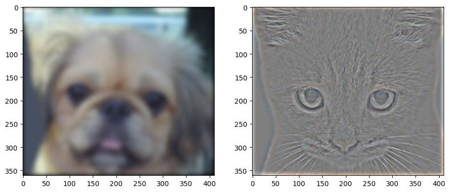
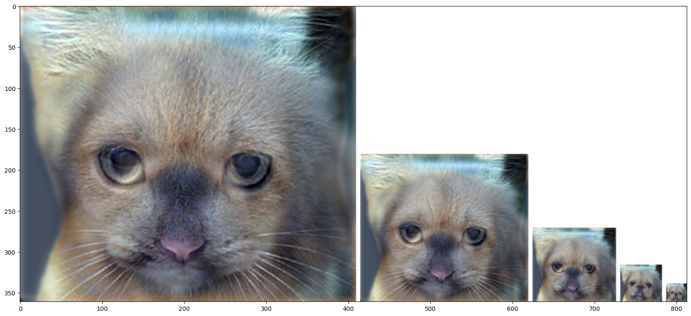

# Hybrid Images

This project aims to blend two images to show one image up close, and the other image from a distance. We know that low frequency components are visible from a distance, and higher frequency components are more visible up close. Based on a tunable threshold, we can optimize the salience of near and far images.

## Low and High Frequency Components

## Result Blend

### *Notice that the image on the far right appears as a dog, transitioning from a cat.*

